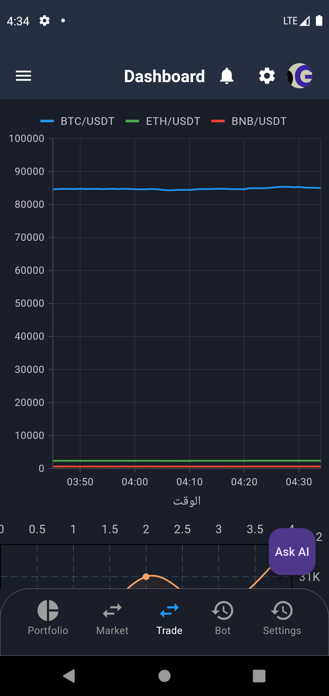
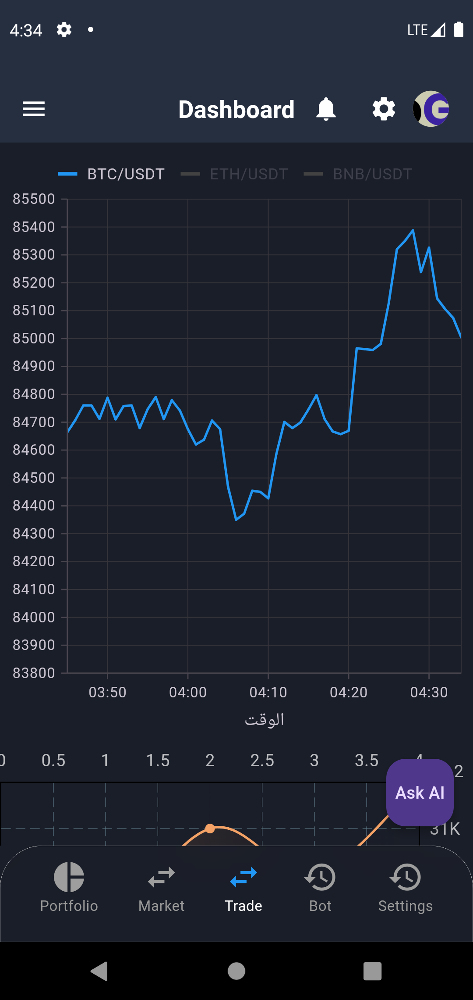
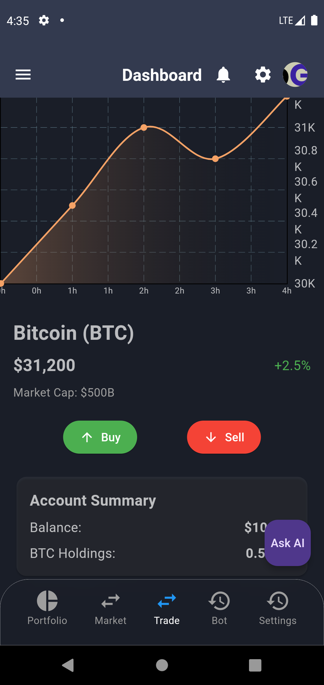
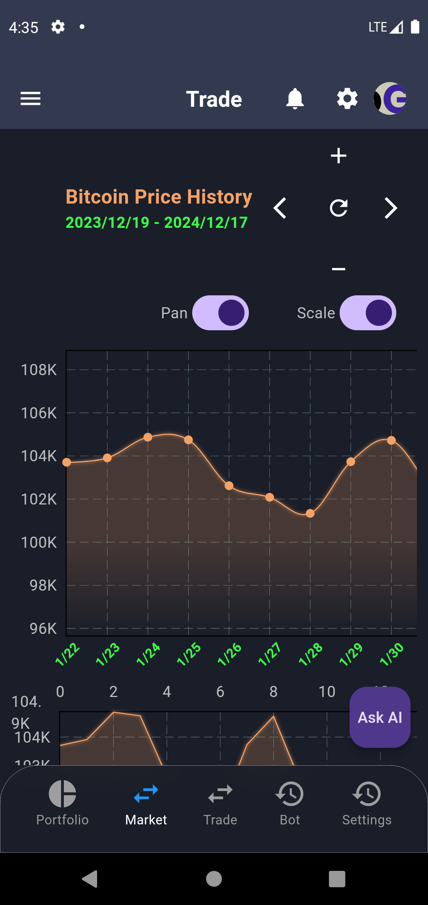
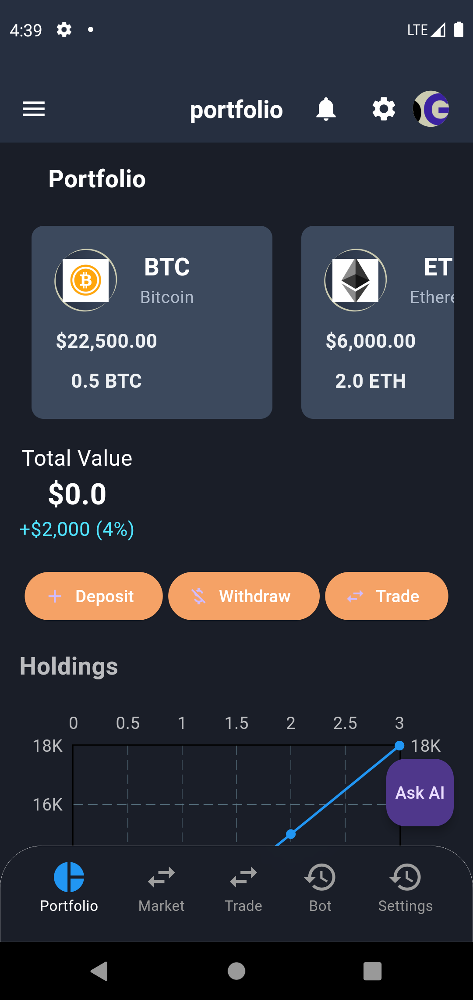
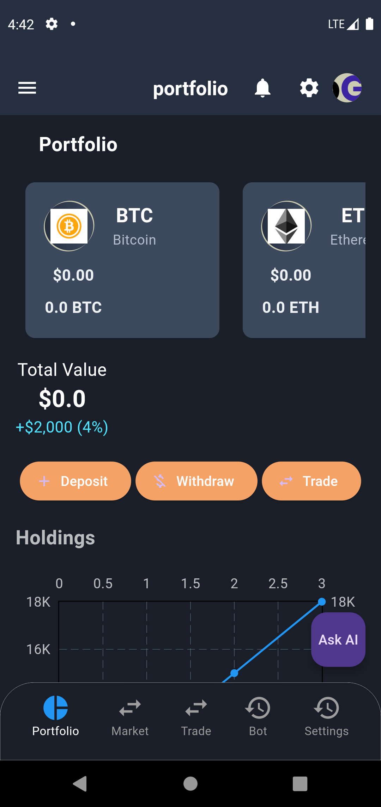
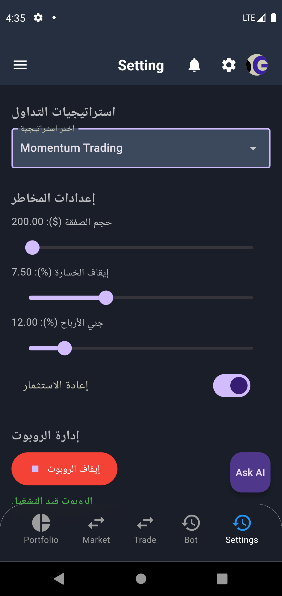
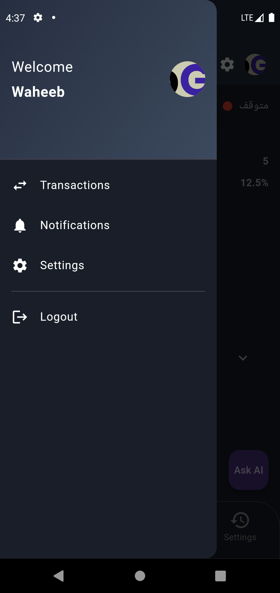
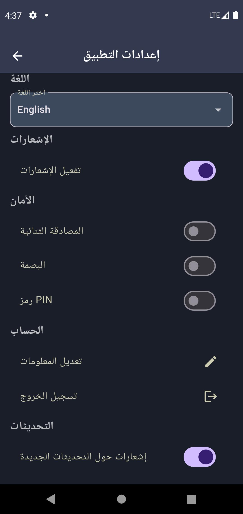
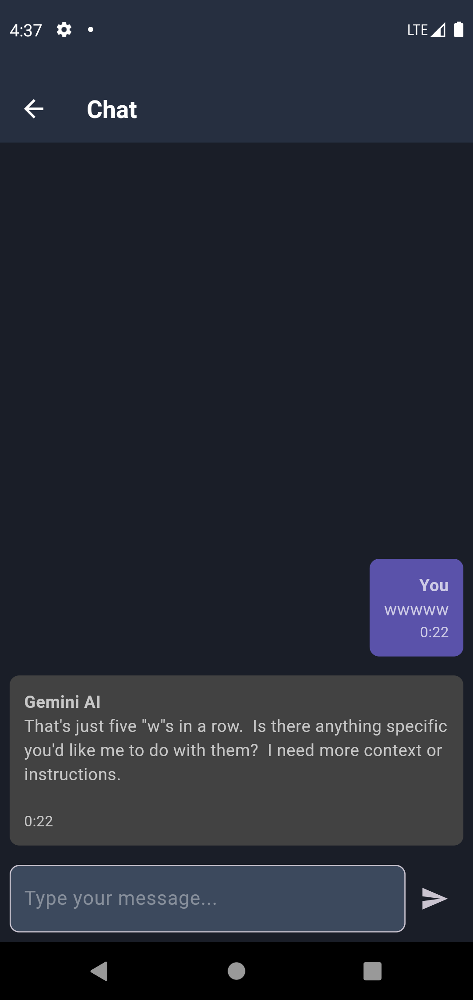

# Flutter Crypto App

## Overview

The Flutter Crypto App is a cutting-edge mobile application designed for cryptocurrency enthusiasts and traders. Built with Flutter, this app provides real-time insights into the cryptocurrency market, empowering users to make informed decisions.

## Features

- **Real-Time Price Tracking**: Stay updated with live prices of popular cryptocurrencies.
- **Historical Data Visualization**: Analyze trends with detailed historical charts.
- **Interactive Charts**: Explore market movements with intuitive and interactive charts.
- **Price Alerts**: Set notifications for price changes and never miss an opportunity.
- **User-Friendly Interface**: Enjoy a seamless experience optimized for both mobile and tablet devices.

## Screenshots

Below are some screenshots of the app:

- 
- 
- 
- 
- 
- 
- 
- 
- 
- 
- 
- 

## Getting Started

To get started with the Flutter Crypto App, follow these steps:

1. Clone the repository:

   ```bash
   git clone https://github.com/waheebedrees/flutter-crypto-app.git
   ```

2. Navigate to the project directory:

   ```bash
   cd flutter-crypto-app
   ```

3. Install dependencies:

   ```bash
   flutter pub get
   ```

4. Run the app:
   ```bash
   flutter run
   ```

## Documentation

For detailed guidance on Flutter development, visit the [official Flutter documentation](https://docs.flutter.dev/).

## License

This project is licensed under the MIT License. See the LICENSE file for more details.
